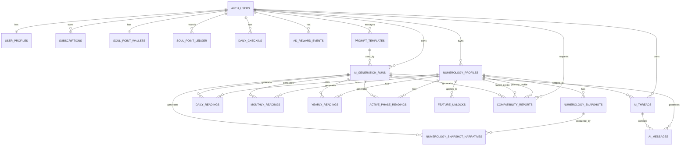

# Numverse Data Model

## Mục đích

Tài liệu này định nghĩa `data model` mới cho `Numverse` theo hướng `Supabase-first`, dựa trên:
- [NUMVERSE_PRODUCT_SUMMARY.md](/Users/uranidev/Documents/Numverse/NUMVERSE_PRODUCT_SUMMARY.md)
- [NUMVERSE_MOBILE_WIREFRAMES_LOFI.md](/Users/uranidev/Documents/Numverse/NUMVERSE_MOBILE_WIREFRAMES_LOFI.md)
- [NUMVERSE_USER_FLOW_UX_LOGIC.md](/Users/uranidev/Documents/Numverse/NUMVERSE_USER_FLOW_UX_LOGIC.md)

Mục tiêu:
- bám đúng các tab và flow đã chốt
- phù hợp với `Supabase Auth + Postgres + RLS + Edge Functions`
- phân tách rõ `source data`, `deterministic numerology`, `AI narratives`, `time-based data`, `Soul Point`, `NumAI`

## 1. Nguyên tắc thiết kế cho Supabase

### 1.1. Dùng `auth.users` làm gốc danh tính

- Không tạo bảng `users` riêng làm source of truth cho auth.
- Mọi bảng nghiệp vụ sẽ tham chiếu tới `auth.users.id`.
- Dữ liệu mở rộng của user được đặt trong `public.user_profiles`.

### 1.2. Dùng `public` cho dữ liệu ứng dụng

Các bảng ứng dụng nên nằm trong schema `public`:
- dễ dùng với Supabase client
- dễ áp `RLS`
- dễ query từ mobile app và Edge Functions

### 1.3. Ưu tiên `owner_user_id` trên các bảng nghiệp vụ

Thay vì luôn suy ra owner qua nhiều tầng relation, nên lưu trực tiếp:
- `owner_user_id uuid not null references auth.users(id)`

Lợi ích:
- RLS đơn giản hơn
- query nhanh hơn
- dễ audit dữ liệu theo user

### 1.4. Dùng `jsonb` cho dữ liệu numerology đã tính

Với `Luận giải`, `Hôm nay`, `Tương hợp`, không nên chuẩn hóa quá mức ngay từ đầu.

Nên:
- giữ dữ liệu nguồn ở dạng cột rõ ràng
- giữ dữ liệu diễn giải / tính toán ở `jsonb`

Lý do:
- công thức numerology và format content có thể thay đổi
- MVP cần linh hoạt
- Postgres trên Supabase hỗ trợ `jsonb` tốt

### 1.5. Tách dữ liệu đọc và dữ liệu tính toán

- `numerology_profiles`: dữ liệu người dùng nhập
- `numerology_snapshots`: bộ số và cấu trúc `life-based` tính bằng code / deterministic
- `numerology_snapshot_narratives`: diễn giải `life-based` do AI generate từ snapshot
- `daily_readings`: preview cho tab `Hôm nay`, trong đó số được tính deterministic và narrative được AI generate
- `monthly_readings`: detail cache cho màn `Chi tiết tháng này`
- `yearly_readings`: detail cache cho màn `Chi tiết năm nay`
- `active_phase_readings`: detail cache cho màn `Chi tiết giai đoạn active`
- `compatibility_reports`: kết quả tương hợp, trong đó score/structure có thể deterministic và narrative do AI generate
- `ai_threads`, `ai_messages`: lịch sử chat

### 1.6. Tách `deterministic layer` và `narrative layer`

- `Deterministic layer` là source of truth cho numerology:
  - số chủ đạo
  - số biểu đạt
  - số linh hồn
  - số nhân cách
  - biểu đồ ngày sinh
  - trục, mũi tên
  - 4 đỉnh cao
  - 4 thử thách
  - năm / tháng / ngày cá nhân
- `Narrative layer` là phần text do AI sinh ra từ các kết quả trên:
  - chân dung cá nhân
  - diễn giải chỉ số
  - insight hôm nay
  - nên làm / nên tránh
  - diễn giải tương hợp

### 1.7. Tách quyền truy cập khỏi dữ liệu nội dung

Nội dung có thể được tính sẵn nhưng quyền hiển thị phụ thuộc vào:
- `subscriptions`
- `feature_unlocks`
- `soul_point_wallets`
- `soul_point_ledger`

### 1.8. Prompt là dữ liệu hệ thống có version

- Prompt cho Gemini được lưu trong database, không hard-code ở mobile app.
- Prompt phải được version hóa để có thể đổi wording, rollback, và audit output.
- Mỗi lần generate phải ghi nhận prompt nào đã được dùng.
- Runtime chỉ nên dùng `active prompt version` cho từng `prompt_key`.

## 2. Supabase Stack Assumption

Data model này giả định:
- `Supabase Auth` cho đăng nhập
- `Postgres` là database chính
- `Row Level Security` bật cho toàn bộ bảng `public`
- `Edge Functions` dùng cho:
  - tính numerology deterministic
  - generate `numerology_snapshot_narratives` qua Gemini
  - generate narrative cho `daily_readings`
  - generate narrative cho `monthly_readings`
  - generate narrative cho `yearly_readings`
  - generate narrative cho `active_phase_readings`
  - generate `compatibility_reports`
  - gọi model cho `NumAI`
  - verify billing / sync entitlement nếu cần

## 3. Naming Convention

### 3.1. Kiểu dữ liệu

- `uuid` cho primary key
- `timestamptz` cho tất cả timestamp
- `date` cho ngày sinh và ngày local
- `jsonb` cho derived content
- `text` cho string chính

### 3.2. Cột chuẩn

Hầu hết các bảng nên có:
- `id uuid primary key default gen_random_uuid()`
- `owner_user_id uuid not null references auth.users(id) on delete cascade`
- `created_at timestamptz not null default now()`
- `updated_at timestamptz not null default now()`

Riêng bảng one-to-one với `auth.users` có thể dùng `id` chính là `auth.users.id`.

## 4. Enum đề xuất

Các enum này nên được tạo ở Postgres để tránh string rời rạc.

### 4.1. `profile_kind`

- `self`
- `other`

### 4.2. `relation_kind`

- `self`
- `lover`
- `spouse`
- `friend`
- `mother`
- `father`
- `child`
- `sibling`
- `coworker`
- `other`

### 4.3. `subscription_status`

- `trialing`
- `active`
- `grace_period`
- `canceled`
- `expired`

### 4.4. `feature_code`

- `today_detail`
- `month_detail`
- `year_detail`
- `active_phase_detail`
- `numai_message`

### 4.5. `unlock_source`

- `subscription`
- `soul_point`
- `admin`

### 4.6. `ledger_direction`

- `credit`
- `debit`

### 4.7. `ledger_source_type`

- `daily_checkin`
- `streak_bonus`
- `ad_reward`
- `today_unlock`
- `numai_message`
- `manual_adjustment`

### 4.8. `generation_kind`

- `snapshot_narrative`
- `daily_reading_narrative`
- `monthly_reading_narrative`
- `yearly_reading_narrative`
- `active_phase_narrative`
- `compatibility_narrative`
- `numai_reply`

### 4.9. `generation_status`

- `queued`
- `running`
- `succeeded`
- `failed`

## 5. ER Overview



## 6. Tables

## 6.1. `public.user_profiles`

Mục đích:
- dữ liệu app-level của user
- không chứa numerology data

Quan hệ:
- one-to-one với `auth.users`

| Column | Type | Required | Notes |
|---|---|---:|---|
| `id` | `uuid` | yes | PK, FK -> `auth.users.id` |
| `display_name` | `text` | no | Tên hiển thị |
| `locale` | `text` | yes | Default `vi-VN` |
| `timezone` | `text` | yes | Default `Asia/Ho_Chi_Minh` |
| `onboarding_completed` | `boolean` | yes | Default `false` |
| `last_active_at` | `timestamptz` | no |  |
| `created_at` | `timestamptz` | yes | Default `now()` |
| `updated_at` | `timestamptz` | yes | Default `now()` |

`RLS`:
- user chỉ `select/update` record có `id = auth.uid()`

## 6.2. `public.user_settings`

Mục đích:
- lưu cài đặt ứng dụng

| Column | Type | Required | Notes |
|---|---|---:|---|
| `user_id` | `uuid` | yes | PK, FK -> `auth.users.id` |
| `language` | `text` | yes | Default `vi` |
| `timezone` | `text` | yes | Có thể mirror từ `user_profiles` |
| `daily_notification_enabled` | `boolean` | yes | Default `true` |
| `daily_notification_time` | `time` | no |  |
| `marketing_opt_in` | `boolean` | yes | Default `false` |
| `analytics_opt_in` | `boolean` | yes | Default `true` |
| `created_at` | `timestamptz` | yes |  |
| `updated_at` | `timestamptz` | yes |  |

`RLS`:
- user chỉ truy cập record của chính mình

## 6.3. `public.subscriptions`

Mục đích:
- lưu quyền `VIP PRO`

| Column | Type | Required | Notes |
|---|---|---:|---|
| `id` | `uuid` | yes | PK |
| `owner_user_id` | `uuid` | yes | FK -> `auth.users.id` |
| `provider` | `text` | yes | `app_store`, `google_play` |
| `product_code` | `text` | yes | SKU |
| `status` | `subscription_status` | yes |  |
| `started_at` | `timestamptz` | yes |  |
| `expires_at` | `timestamptz` | no |  |
| `auto_renew` | `boolean` | yes |  |
| `provider_customer_id` | `text` | no |  |
| `provider_subscription_id` | `text` | no |  |
| `entitlements_json` | `jsonb` | no | Ví dụ `{"today_full": true, "numai_unmetered": true}` |
| `last_verified_at` | `timestamptz` | no |  |
| `created_at` | `timestamptz` | yes |  |
| `updated_at` | `timestamptz` | yes |  |

`RLS`:
- user được `select` subscription của chính mình
- insert/update chủ yếu qua `service_role` hoặc `Edge Function`

## 6.4. `public.numerology_profiles`

Mục đích:
- hồ sơ dùng để luận giải
- gồm hồ sơ bản thân và hồ sơ người khác

| Column | Type | Required | Notes |
|---|---|---:|---|
| `id` | `uuid` | yes | PK |
| `owner_user_id` | `uuid` | yes | FK -> `auth.users.id` |
| `profile_kind` | `profile_kind` | yes | `self`, `other` |
| `relation_kind` | `relation_kind` | yes |  |
| `display_name` | `text` | yes | Tên ngắn trên UI |
| `full_name_for_reading` | `text` | yes | Họ tên dùng để tính numerology |
| `birth_date` | `date` | yes |  |
| `gender` | `text` | no | Nếu cần dùng trong content |
| `is_primary` | `boolean` | yes | Chỉ 1 hồ sơ chính |
| `notes` | `text` | no | Ghi chú nội bộ |
| `archived_at` | `timestamptz` | no | Soft delete |
| `created_at` | `timestamptz` | yes |  |
| `updated_at` | `timestamptz` | yes |  |

`Constraints`:
- partial unique index cho `owner_user_id` khi `is_primary = true and archived_at is null`

`RLS`:
- user chỉ truy cập hồ sơ của chính mình

## 6.5. `public.numerology_snapshots`

Mục đích:
- lưu `bộ số` và `cấu trúc` `life-based` tính bằng code / deterministic
- snapshot theo version của engine
- tránh phải tính lại mỗi lần mở app
- không chứa phần diễn giải AI chi tiết

| Column | Type | Required | Notes |
|---|---|---:|---|
| `id` | `uuid` | yes | PK |
| `owner_user_id` | `uuid` | yes | FK -> `auth.users.id` |
| `numerology_profile_id` | `uuid` | yes | FK -> `public.numerology_profiles.id` |
| `engine_version` | `text` | yes | Version calculator |
| `source_hash` | `text` | yes | Hash từ input normalized |
| `is_current` | `boolean` | yes | Snapshot active |
| `raw_input_json` | `jsonb` | yes | Input normalized |
| `core_numbers_json` | `jsonb` | yes | Chỉ các số cốt lõi, không kèm narrative |
| `birth_matrix_json` | `jsonb` | yes | Biểu đồ ngày sinh, số mạnh/yếu/thiếu |
| `matrix_aspects_json` | `jsonb` | yes | Trục và mũi tên tính theo công thức |
| `life_cycles_json` | `jsonb` | yes | 4 đỉnh cao, 4 thử thách |
| `calculated_at` | `timestamptz` | yes |  |
| `created_at` | `timestamptz` | yes |  |

`RLS`:
- user chỉ đọc snapshot thuộc `owner_user_id = auth.uid()`
- insert/update qua `Edge Function` hoặc `service_role`

`Recommended JSON structure`:

```json
{
  "core_numbers": {
    "life_path": { "value": 7, "title": "So chu dao" },
    "expression": { "value": 3, "title": "So bieu dat" },
    "soul_urge": { "value": 2, "title": "So linh hon" },
    "personality": { "value": 1, "title": "So nhan cach" }
  },
  "birth_matrix": {
    "grid": [[1, 4, 7], [2, null, 8], [3, null, 9]],
    "strong_numbers": [1, 7],
    "weak_numbers": [2, 8],
    "missing_numbers": [5, 6]
  },
  "matrix_aspects": {
    "axes": [],
    "arrows": []
  },
  "life_cycles": {
    "peaks": [],
    "challenges": []
  }
}
```

## 6.6. `public.numerology_snapshot_narratives`

Mục đích:
- lưu phần diễn giải chi tiết `life-based` do Gemini generate
- tách khỏi `numerology_snapshots` để có thể regenerate text mà không đổi bộ số

| Column | Type | Required | Notes |
|---|---|---:|---|
| `id` | `uuid` | yes | PK |
| `owner_user_id` | `uuid` | yes | FK -> `auth.users.id` |
| `numerology_snapshot_id` | `uuid` | yes | FK -> `public.numerology_snapshots.id` |
| `ai_generation_run_id` | `uuid` | no | FK -> `public.ai_generation_runs.id` |
| `prompt_template_id` | `uuid` | no | FK -> `public.prompt_templates.id` |
| `locale` | `text` | yes | Ví dụ `vi-VN` |
| `model_provider` | `text` | yes | Ví dụ `gemini` |
| `model_name` | `text` | yes | Ví dụ `gemini-2.5-pro` |
| `prompt_version` | `text` | yes | Version prompt |
| `schema_version` | `text` | no | Version output schema |
| `status` | `generation_status` | yes |  |
| `is_current` | `boolean` | yes | Narrative active hiện tại |
| `sections_json` | `jsonb` | yes | Toàn bộ diễn giải theo section |
| `generated_at` | `timestamptz` | yes |  |
| `created_at` | `timestamptz` | yes |  |
| `updated_at` | `timestamptz` | yes |  |

`RLS`:
- user chỉ đọc narrative của chính mình
- insert/update qua `Edge Function` hoặc `service_role`

`Recommended JSON structure`:

```json
{
  "core_numbers": {
    "life_path": {
      "summary": "...",
      "deep_meaning": "...",
      "strengths": ["..."],
      "balance_points": ["..."]
    }
  },
  "birth_matrix": {
    "overview": "...",
    "strong_numbers": "...",
    "weak_numbers": "...",
    "missing_numbers": "..."
  },
  "matrix_aspects": {
    "physical_axis": "...",
    "emotional_axis": "...",
    "intellectual_axis": "...",
    "arrows": []
  },
  "life_cycles": {
    "peaks": [],
    "challenges": []
  },
  "persona": {
    "overview": "...",
    "communication_style": "...",
    "love_style": "...",
    "career_fit": "..."
  }
}
```

## 6.7. `public.daily_readings`

Mục đích:
- lưu dữ liệu cho tab `Hôm nay`
- phục vụ `preview layer` cho màn home của tab `Hôm nay`
- trong đó phần số là deterministic, phần text là AI-generated narrative

| Column | Type | Required | Notes |
|---|---|---:|---|
| `id` | `uuid` | yes | PK |
| `owner_user_id` | `uuid` | yes | FK -> `auth.users.id` |
| `numerology_profile_id` | `uuid` | yes | FK -> `public.numerology_profiles.id` |
| `local_date` | `date` | yes | Ngày theo timezone user |
| `timezone` | `text` | yes | Dùng để trace |
| `engine_version` | `text` | yes |  |
| `personal_year` | `smallint` | yes |  |
| `personal_month` | `smallint` | yes |  |
| `personal_day` | `smallint` | yes |  |
| `active_peak_number` | `smallint` | no | Phần deterministic |
| `active_challenge_number` | `smallint` | no | Phần deterministic |
| `energy_score` | `smallint` | no | Ví dụ `1..10` |
| `daily_rhythm` | `text` | no | Ví dụ `Tinh - Quan sat` |
| `daily_insight_short` | `text` | yes | Free layer |
| `daily_insight_full` | `text` | no | PRO layer |
| `action_do_json` | `jsonb` | yes | Nên làm |
| `action_avoid_json` | `jsonb` | yes | Nên tránh |
| `month_context_json` | `jsonb` | yes | Tháng này |
| `year_context_json` | `jsonb` | yes | Năm nay |
| `active_phase_json` | `jsonb` | no | Đỉnh cao active + thử thách active |
| `ai_generation_run_id` | `uuid` | no | FK -> `public.ai_generation_runs.id` |
| `prompt_template_id` | `uuid` | no | FK -> `public.prompt_templates.id` |
| `model_name` | `text` | no | Model dùng để generate narrative |
| `prompt_version` | `text` | no | Version prompt narrative |
| `generated_at` | `timestamptz` | yes |  |
| `created_at` | `timestamptz` | yes |  |

`Constraints`:
- unique index trên `(numerology_profile_id, local_date, engine_version)`

`RLS`:
- user chỉ đọc record của chính mình
- ghi qua `Edge Function`

`Note`:
- `personal_year`, `personal_month`, `personal_day`, `active_peak_number`, `active_challenge_number` là deterministic
- `daily_insight_*`, `action_*`, `month_context_json`, `year_context_json`, `active_phase_json` là narrative do AI generate
- `month_context_json`, `year_context_json`, `active_phase_json` chỉ nên là preview ngắn để dẫn sang màn detail riêng

## 6.8. `public.monthly_readings`

Mục đích:
- lưu detail cache cho màn `Chi tiết tháng này`
- tách khỏi `daily_readings` để không phải generate lại nội dung dài mỗi ngày

| Column | Type | Required | Notes |
|---|---|---:|---|
| `id` | `uuid` | yes | PK |
| `owner_user_id` | `uuid` | yes | FK -> `auth.users.id` |
| `numerology_profile_id` | `uuid` | yes | FK -> `public.numerology_profiles.id` |
| `local_year` | `smallint` | yes | Theo timezone user |
| `local_month` | `smallint` | yes | `1..12` |
| `timezone` | `text` | yes | Dùng để trace |
| `engine_version` | `text` | yes |  |
| `personal_year` | `smallint` | yes | Deterministic |
| `personal_month` | `smallint` | yes | Deterministic |
| `headline` | `text` | yes | Tiêu đề ngắn cho màn detail |
| `summary_text` | `text` | yes | Tổng quan tháng |
| `focus_text` | `text` | yes | Trọng tâm tháng |
| `opportunities_json` | `jsonb` | yes | Cơ hội / điểm thuận |
| `cautions_json` | `jsonb` | yes | Điều cần chú ý |
| `guidance_json` | `jsonb` | yes | Gợi ý hành động |
| `ai_generation_run_id` | `uuid` | no | FK -> `public.ai_generation_runs.id` |
| `prompt_template_id` | `uuid` | no | FK -> `public.prompt_templates.id` |
| `model_name` | `text` | no |  |
| `prompt_version` | `text` | no |  |
| `generated_at` | `timestamptz` | yes |  |
| `created_at` | `timestamptz` | yes |  |

`Constraints`:
- unique index trên `(numerology_profile_id, local_year, local_month, engine_version)`

`RLS`:
- user chỉ đọc record của chính mình
- ghi qua `Edge Function`

`Note`:
- record chỉ generate khi user thực sự mở màn `Chi tiết tháng này`
- đây là cache theo `year-month`, không regenerate mỗi ngày

## 6.9. `public.yearly_readings`

Mục đích:
- lưu detail cache cho màn `Chi tiết năm nay`
- dùng cho content dài của năm cá nhân

| Column | Type | Required | Notes |
|---|---|---:|---|
| `id` | `uuid` | yes | PK |
| `owner_user_id` | `uuid` | yes | FK -> `auth.users.id` |
| `numerology_profile_id` | `uuid` | yes | FK -> `public.numerology_profiles.id` |
| `local_year` | `smallint` | yes | Theo timezone user |
| `timezone` | `text` | yes | Dùng để trace |
| `engine_version` | `text` | yes |  |
| `personal_year` | `smallint` | yes | Deterministic |
| `headline` | `text` | yes | Tiêu đề ngắn cho màn detail |
| `summary_text` | `text` | yes | Tổng quan năm |
| `theme_text` | `text` | yes | Chủ đề / năng lượng năm |
| `priorities_json` | `jsonb` | yes | Điều nên ưu tiên |
| `cautions_json` | `jsonb` | yes | Điều cần chú ý |
| `guidance_json` | `jsonb` | yes | Gợi ý ứng dụng |
| `ai_generation_run_id` | `uuid` | no | FK -> `public.ai_generation_runs.id` |
| `prompt_template_id` | `uuid` | no | FK -> `public.prompt_templates.id` |
| `model_name` | `text` | no |  |
| `prompt_version` | `text` | no |  |
| `generated_at` | `timestamptz` | yes |  |
| `created_at` | `timestamptz` | yes |  |

`Constraints`:
- unique index trên `(numerology_profile_id, local_year, engine_version)`

`RLS`:
- user chỉ đọc record của chính mình
- ghi qua `Edge Function`

`Note`:
- record chỉ generate khi user mở màn `Chi tiết năm nay`
- đây là cache theo `year`

## 6.10. `public.active_phase_readings`

Mục đích:
- lưu detail cache cho màn `Chi tiết giai đoạn active`
- nối `time-based` với `life-based`

| Column | Type | Required | Notes |
|---|---|---:|---|
| `id` | `uuid` | yes | PK |
| `owner_user_id` | `uuid` | yes | FK -> `auth.users.id` |
| `numerology_profile_id` | `uuid` | yes | FK -> `public.numerology_profiles.id` |
| `phase_key` | `text` | yes | Key xác định giai đoạn active hiện tại |
| `phase_start_date` | `date` | no |  |
| `phase_end_date` | `date` | no |  |
| `timezone` | `text` | yes | Dùng để trace |
| `engine_version` | `text` | yes |  |
| `active_peak_number` | `smallint` | no | Deterministic |
| `active_challenge_number` | `smallint` | no | Deterministic |
| `headline` | `text` | yes | Tiêu đề ngắn cho màn detail |
| `summary_text` | `text` | yes | Tổng quan giai đoạn |
| `peak_text` | `text` | no | Diễn giải đỉnh cao active |
| `challenge_text` | `text` | no | Diễn giải thử thách active |
| `guidance_json` | `jsonb` | yes | Gợi ý ứng xử / phát triển |
| `ai_generation_run_id` | `uuid` | no | FK -> `public.ai_generation_runs.id` |
| `prompt_template_id` | `uuid` | no | FK -> `public.prompt_templates.id` |
| `model_name` | `text` | no |  |
| `prompt_version` | `text` | no |  |
| `generated_at` | `timestamptz` | yes |  |
| `created_at` | `timestamptz` | yes |  |

`Constraints`:
- unique index trên `(numerology_profile_id, phase_key, engine_version)`

`RLS`:
- user chỉ đọc record của chính mình
- ghi qua `Edge Function`

`Note`:
- `phase_key` nên được derive ổn định từ logic deterministic
- record chỉ generate khi user mở màn `Chi tiết giai đoạn active`

## 6.11. `public.feature_unlocks`

Mục đích:
- lưu các lần mở khóa lẻ bằng `Soul Point`
- áp dụng cho deep content trong `Hôm nay`
- có thể dùng cho `NumAI` nếu sau này muốn mở theo batch

| Column | Type | Required | Notes |
|---|---|---:|---|
| `id` | `uuid` | yes | PK |
| `owner_user_id` | `uuid` | yes | FK -> `auth.users.id` |
| `numerology_profile_id` | `uuid` | no | FK -> `public.numerology_profiles.id` |
| `feature_code` | `feature_code` | yes |  |
| `scope_key` | `text` | yes | Ví dụ `2026-03-04`, `2026-03`, `2026`, `peak2-challenge1-2026-01-01-2026-12-31` |
| `unlock_source` | `unlock_source` | yes |  |
| `soul_point_cost` | `integer` | no |  |
| `starts_at` | `timestamptz` | yes |  |
| `expires_at` | `timestamptz` | yes |  |
| `metadata_json` | `jsonb` | no |  |
| `created_at` | `timestamptz` | yes |  |

`RLS`:
- user chỉ đọc record của chính mình
- insert qua function xử lý point

## 6.12. `public.soul_point_wallets`

Mục đích:
- cache số dư hiện tại để đọc nhanh

| Column | Type | Required | Notes |
|---|---|---:|---|
| `user_id` | `uuid` | yes | PK, FK -> `auth.users.id` |
| `balance` | `integer` | yes | Default `0` |
| `lifetime_earned` | `integer` | yes | Default `0` |
| `lifetime_spent` | `integer` | yes | Default `0` |
| `created_at` | `timestamptz` | yes |  |
| `updated_at` | `timestamptz` | yes |  |

`RLS`:
- user chỉ đọc wallet của chính mình
- update qua RPC / transaction server-side

## 6.13. `public.soul_point_ledger`

Mục đích:
- sổ cái bất biến cho toàn bộ biến động `Soul Point`

| Column | Type | Required | Notes |
|---|---|---:|---|
| `id` | `uuid` | yes | PK |
| `owner_user_id` | `uuid` | yes | FK -> `auth.users.id` |
| `direction` | `ledger_direction` | yes | `credit` hoặc `debit` |
| `amount` | `integer` | yes | Luôn dương |
| `source_type` | `ledger_source_type` | yes |  |
| `source_ref_id` | `uuid` | no | Event gốc |
| `balance_after` | `integer` | yes | Snapshot sau giao dịch |
| `metadata_json` | `jsonb` | no | Ví dụ `{"feature_code":"today_detail"}` |
| `created_at` | `timestamptz` | yes |  |

`RLS`:
- user chỉ đọc ledger của chính mình
- insert bằng RPC hoặc Edge Function

## 6.14. `public.daily_checkins`

Mục đích:
- track điểm danh hằng ngày
- cấp point
- tính streak

| Column | Type | Required | Notes |
|---|---|---:|---|
| `id` | `uuid` | yes | PK |
| `owner_user_id` | `uuid` | yes | FK -> `auth.users.id` |
| `local_date` | `date` | yes | Theo timezone user |
| `streak_count` | `integer` | yes |  |
| `reward_amount` | `integer` | yes |  |
| `created_at` | `timestamptz` | yes |  |

`Constraints`:
- unique index `(owner_user_id, local_date)`

## 6.15. `public.ad_reward_events`

Mục đích:
- log lượt quảng cáo đổi point

| Column | Type | Required | Notes |
|---|---|---:|---|
| `id` | `uuid` | yes | PK |
| `owner_user_id` | `uuid` | yes | FK -> `auth.users.id` |
| `ad_network` | `text` | yes |  |
| `placement_code` | `text` | yes |  |
| `reward_amount` | `integer` | yes |  |
| `status` | `text` | yes | `pending`, `granted`, `rejected` |
| `metadata_json` | `jsonb` | no |  |
| `created_at` | `timestamptz` | yes |  |

## 6.16. `public.compatibility_reports`

Mục đích:
- lưu dữ liệu tab `Tương hợp`
- trong đó score / structure có thể tính deterministic, còn diễn giải quan hệ là AI-generated

| Column | Type | Required | Notes |
|---|---|---:|---|
| `id` | `uuid` | yes | PK |
| `owner_user_id` | `uuid` | yes | FK -> `auth.users.id` |
| `primary_profile_id` | `uuid` | yes | FK -> `public.numerology_profiles.id` |
| `target_profile_id` | `uuid` | yes | FK -> `public.numerology_profiles.id` |
| `engine_version` | `text` | yes |  |
| `score` | `smallint` | yes | `0..100` |
| `compatibility_structure_json` | `jsonb` | no | Phần deterministic / semi-deterministic |
| `summary` | `text` | yes | Nhận định chung |
| `strengths_json` | `jsonb` | yes | Điểm hợp |
| `tensions_json` | `jsonb` | yes | Điểm xung đột |
| `guidance_json` | `jsonb` | yes | Gợi ý quan hệ |
| `ai_generation_run_id` | `uuid` | no | FK -> `public.ai_generation_runs.id` |
| `prompt_template_id` | `uuid` | no | FK -> `public.prompt_templates.id` |
| `model_name` | `text` | no | Model dùng để generate narrative |
| `prompt_version` | `text` | no | Version prompt narrative |
| `calculated_at` | `timestamptz` | yes |  |
| `created_at` | `timestamptz` | yes |  |

`RLS`:
- user chỉ đọc report của chính mình

`Note`:
- report được cache theo cặp hồ sơ + engine version
- nên index `(owner_user_id, primary_profile_id, target_profile_id, engine_version)`
- `score` và `compatibility_structure_json` nên được xem là data layer ổn định hơn narrative text

## 6.17. `public.prompt_templates`

Mục đích:
- lưu prompt cho các nhóm chức năng AI trong database
- cho phép đổi prompt mà không cần deploy app
- hỗ trợ versioning, rollback, audit

`Prompt key` ban đầu nên có:
- `life_snapshot_narrative`
- `daily_reading_narrative`
- `monthly_reading_narrative`
- `yearly_reading_narrative`
- `active_phase_narrative`
- `compatibility_narrative`
- `numai_chat_reply`

| Column | Type | Required | Notes |
|---|---|---:|---|
| `id` | `uuid` | yes | PK |
| `prompt_key` | `text` | yes | Key logic của prompt |
| `version` | `text` | yes | Ví dụ `v1`, `2026-03-04.1` |
| `locale` | `text` | yes | Ví dụ `vi-VN` |
| `status` | `text` | yes | `draft`, `active`, `archived` |
| `provider` | `text` | yes | Ví dụ `gemini` |
| `model_name` | `text` | yes | Model mặc định cho prompt này |
| `temperature` | `numeric(3,2)` | no |  |
| `max_output_tokens` | `integer` | no |  |
| `system_prompt` | `text` | yes | System instruction |
| `task_prompt_template` | `text` | yes | Template chính để render request |
| `context_schema_json` | `jsonb` | no | Schema context mong muốn |
| `output_schema_json` | `jsonb` | no | Schema output mong muốn |
| `notes` | `text` | no | Ghi chú nội bộ |
| `created_by` | `uuid` | no | FK -> `auth.users.id`, thường là admin |
| `created_at` | `timestamptz` | yes |  |
| `updated_at` | `timestamptz` | yes |  |

`RLS`:
- không mở read trực tiếp cho end-user thông thường
- read/write chủ yếu qua `service_role`, admin tool, hoặc dashboard nội bộ

`Runtime note`:
- Edge Function lấy bản ghi `active` theo `prompt_key` + `locale`
- có thể cache ngắn hạn ở server để giảm query lặp
- không nên để mobile app query bảng này trực tiếp

## 6.18. `public.ai_generation_runs`

Mục đích:
- audit log chung cho mọi lần Gemini generate
- trace prompt, model, input, output, lỗi
- tách khỏi bảng nghiệp vụ để dễ debug và regenerate

| Column | Type | Required | Notes |
|---|---|---:|---|
| `id` | `uuid` | yes | PK |
| `owner_user_id` | `uuid` | yes | FK -> `auth.users.id` |
| `generation_kind` | `generation_kind` | yes |  |
| `prompt_template_id` | `uuid` | no | FK -> `public.prompt_templates.id` |
| `prompt_key` | `text` | yes |  |
| `target_table` | `text` | yes | Ví dụ `numerology_snapshot_narratives` |
| `target_id` | `uuid` | no | ID record đích nếu đã persist |
| `provider` | `text` | yes | Ví dụ `gemini` |
| `model_name` | `text` | yes |  |
| `prompt_version` | `text` | yes |  |
| `system_prompt_snapshot` | `text` | no | Snapshot prompt để audit khi cần |
| `task_prompt_snapshot` | `text` | no | Snapshot prompt đã render hoặc template dùng |
| `schema_version` | `text` | no | Version output schema |
| `status` | `generation_status` | yes |  |
| `input_hash` | `text` | no | Hash input context |
| `input_context_json` | `jsonb` | yes | Context gửi lên model |
| `output_json` | `jsonb` | no | Parsed output |
| `raw_text_output` | `text` | no | Nếu cần giữ raw response |
| `error_text` | `text` | no |  |
| `latency_ms` | `integer` | no |  |
| `started_at` | `timestamptz` | no |  |
| `completed_at` | `timestamptz` | no |  |
| `created_at` | `timestamptz` | yes |  |

`RLS`:
- user chỉ đọc generation run của chính mình
- insert/update qua `Edge Function` hoặc `service_role`

## 6.19. `public.ai_threads`

Mục đích:
- thread chat trong `NumAI`
- giữ `memory` ngắn hạn và `summary` để tránh phải gửi full history lên Gemini mỗi lượt

| Column | Type | Required | Notes |
|---|---|---:|---|
| `id` | `uuid` | yes | PK |
| `owner_user_id` | `uuid` | yes | FK -> `auth.users.id` |
| `primary_profile_id` | `uuid` | yes | FK -> `public.numerology_profiles.id` |
| `related_profile_id` | `uuid` | no | Dùng khi hỏi về tương hợp |
| `title` | `text` | no |  |
| `thread_summary` | `text` | no | Summary ngắn của thread để reuse làm context |
| `thread_summary_updated_at` | `timestamptz` | no |  |
| `last_message_at` | `timestamptz` | no |  |
| `created_at` | `timestamptz` | yes |  |
| `updated_at` | `timestamptz` | yes |  |

`RLS`:
- user chỉ đọc / tạo thread của mình

## 6.20. `public.ai_messages`

Mục đích:
- lưu message trong chat `NumAI`

| Column | Type | Required | Notes |
|---|---|---:|---|
| `id` | `uuid` | yes | PK |
| `owner_user_id` | `uuid` | yes | FK -> `auth.users.id` |
| `thread_id` | `uuid` | yes | FK -> `public.ai_threads.id` |
| `sender_type` | `text` | yes | `user`, `assistant`, `system` |
| `message_text` | `text` | yes |  |
| `context_snapshot_id` | `uuid` | no | FK -> `public.numerology_snapshots.id` |
| `context_daily_reading_id` | `uuid` | no | FK -> `public.daily_readings.id`, để dành cho phase sau |
| `context_compatibility_report_id` | `uuid` | no | FK -> `public.compatibility_reports.id`, để dành cho phase sau |
| `ai_generation_run_id` | `uuid` | no | FK -> `public.ai_generation_runs.id`, chủ yếu cho assistant message |
| `prompt_template_id` | `uuid` | no | FK -> `public.prompt_templates.id`, thường chỉ có ở assistant message |
| `soul_point_cost` | `integer` | yes | Default `0` |
| `metadata_json` | `jsonb` | no | Token usage, model info, moderation, prompt version |
| `created_at` | `timestamptz` | yes |  |

`RLS`:
- user chỉ đọc message trong thread của mình
- insert user message qua client hoặc function
- assistant message ghi qua Edge Function

`Current MVP payload note`:
- Mỗi request chat hiện tại dùng payload cố định gồm:
  - `thread_summary`
  - `recent_messages`
  - `active_profile`
  - `snapshot_facts`
  - `user_question`
- `daily_facts` và `compatibility_facts` chưa được bơm động theo intent ở giai đoạn hiện tại.

## 6.21. `public.content_templates`

Mục đích:
- chứa template nội dung tĩnh / bán tĩnh cho numerology
- giúp `Luận giải` và `Hôm nay` ổn định hơn, ít phụ thuộc AI hơn

| Column | Type | Required | Notes |
|---|---|---:|---|
| `id` | `uuid` | yes | PK |
| `domain` | `text` | yes | `core_number`, `matrix_axis`, `personal_year`, ... |
| `template_key` | `text` | yes | Ví dụ `life_path_7` |
| `locale` | `text` | yes | `vi-VN` |
| `title` | `text` | yes |  |
| `summary_template` | `text` | yes |  |
| `body_template` | `text` | yes |  |
| `metadata_json` | `jsonb` | no | Tags, keywords |
| `created_at` | `timestamptz` | yes |  |
| `updated_at` | `timestamptz` | yes |  |

`RLS`:
- read-only cho authenticated users hoặc chỉ server-side tùy chiến lược

## 7. Mapping sang Tab / Feature

## 7.1. Tab `Luận giải`

Nguồn dữ liệu chính:
- `public.numerology_profiles`
- `public.numerology_snapshots`
- `public.numerology_snapshot_narratives`

Sections:
- `Chỉ số cốt lõi` -> `core_numbers_json` + `sections_json.core_numbers`
- `Biểu đồ và ma trận` -> `birth_matrix_json`, `matrix_aspects_json` + `sections_json.birth_matrix`, `sections_json.matrix_aspects`
- `Lộ trình cuộc đời` -> `life_cycles_json` + `sections_json.life_cycles`
- `Chân dung cá nhân` -> `sections_json.persona`

Access:
- `Free` xem full

## 7.2. Tab `Hôm nay`

Nguồn dữ liệu chính:
- `public.daily_readings`
- `public.monthly_readings`
- `public.yearly_readings`
- `public.active_phase_readings`
- `public.feature_unlocks`
- `public.subscriptions`
- `public.soul_point_wallets`

Access:
- `Free`:
  - `daily_insight_short`
  - `energy_score`
  - preview `month_context_json`
  - preview `year_context_json`
  - preview `active_phase_json`
- `PRO`:
  - full `daily_insight_full`
  - full `action_do_json`
  - full `action_avoid_json`
  - detail từ `monthly_readings`
  - detail từ `yearly_readings`
  - detail từ `active_phase_readings`
- `Soul Point`:
  - tạo `feature_unlocks` theo scope

## 7.3. Tab `Tương hợp`

Nguồn dữ liệu chính:
- `public.numerology_profiles`
- `public.compatibility_reports`

Access:
- hiện tại data model hỗ trợ cả `free preview` và `PRO`

## 7.4. Tab `NumAI`

Nguồn dữ liệu chính:
- `public.ai_threads`
- `public.ai_messages`
- `public.numerology_snapshots`
- `public.numerology_snapshot_narratives`
- `public.daily_readings`
- `public.compatibility_reports`
- `public.prompt_templates`
- `public.ai_generation_runs`
- `public.soul_point_wallets`
- `public.soul_point_ledger`

Access:
- `Free`:
  - vào được tab
  - gửi từng message nếu đủ point
- `PRO`:
  - vào được tab
  - gửi message trực tiếp

MVP context payload:
- `thread_summary`
- `recent_messages`
- `active_profile`
- `snapshot_facts`
- `user_question`

MVP exclusions:
- chưa inject `daily_facts`
- chưa inject `compatibility_facts`
- chưa dùng `intent detection`

Prompt runtime:
- Edge Function lấy `active prompt template` trong `public.prompt_templates`
- `ai_generation_runs` log lại `prompt_template_id`, `prompt_key`, `prompt_version`

## 7.5. Tab `Tôi`

Nguồn dữ liệu chính:
- `public.user_profiles`
- `public.user_settings`
- `public.numerology_profiles`
- `public.subscriptions`
- `public.soul_point_wallets`

## 8. Derived Data Logic

## 8.1. Khi tạo hoặc sửa `numerology_profile`

```text
profile insert/update
-> normalize input
-> generate source_hash
-> calculate deterministic numerology bằng code
-> create new numerology_snapshot
-> set old snapshot is_current = false
-> create ai_generation_run kind=snapshot_narrative
-> gọi Gemini với context từ snapshot deterministic
-> create numerology_snapshot_narrative mới
-> set old narrative is_current = false
-> invalidate compatibility_reports có liên quan
-> invalidate future daily_readings cache nếu cần
-> invalidate monthly_readings có liên quan
-> invalidate yearly_readings có liên quan
-> invalidate active_phase_readings có liên quan
```

## 8.2. Khi user mở app và vào tab `Hôm nay`

```text
load primary profile
-> tìm daily_reading theo local_date hôm nay
-> nếu chưa có thì:
   -> calculate personal_year, personal_month, personal_day bằng code
   -> derive active_peak_number, active_challenge_number
   -> create ai_generation_run kind=daily_reading_narrative
   -> gọi Gemini để generate hero, action, và preview context
   -> persist daily_reading
-> trả dữ liệu theo access level
```

`Note`:
- `daily_readings` chỉ là preview cache cho màn home của tab `Hôm nay`
- không nên nhét full nội dung dài của `tháng`, `năm`, `giai đoạn active` vào đây

## 8.3. Khi user mở `Chi tiết tháng này`

```text
load primary profile
-> resolve local_year + local_month hiện tại
-> tìm monthly_reading theo profile + year + month
-> nếu chưa có thì:
   -> calculate personal_year + personal_month bằng code
   -> create ai_generation_run kind=monthly_reading_narrative
   -> gọi Gemini để generate monthly detail
   -> persist monthly_reading
-> trả dữ liệu theo access level
```

## 8.4. Khi user mở `Chi tiết năm nay`

```text
load primary profile
-> resolve local_year hiện tại
-> tìm yearly_reading theo profile + year
-> nếu chưa có thì:
   -> calculate personal_year bằng code
   -> create ai_generation_run kind=yearly_reading_narrative
   -> gọi Gemini để generate yearly detail
   -> persist yearly_reading
-> trả dữ liệu theo access level
```

## 8.5. Khi user mở `Chi tiết giai đoạn active`

```text
load primary profile
-> derive current phase_key bằng code
-> tìm active_phase_reading theo profile + phase_key
-> nếu chưa có thì:
   -> derive active_peak_number + active_challenge_number + phase window
   -> create ai_generation_run kind=active_phase_narrative
   -> gọi Gemini để generate active phase detail
   -> persist active_phase_reading
-> trả dữ liệu theo access level
```

## 8.6. Khi free user mở sâu `Hôm nay`

```text
check active subscription
-> nếu PRO thì cho xem
-> nếu không PRO
   -> check feature_unlocks còn hạn
   -> nếu có thì cho xem
   -> nếu chưa có thì trừ Soul Point và tạo feature_unlock
```

## 8.7. Khi free user gửi chat trong `NumAI`

```text
check wallet balance
-> nếu đủ point
   -> debit soul_point_ledger
   -> update soul_point_wallets
   -> create ai_messages sender=user
   -> create ai_generation_run kind=numai_reply
   -> call model qua Edge Function
   -> create ai_messages sender=assistant
-> nếu không đủ point
   -> trả trạng thái thiếu point
```

## 8.8. Khi user tạo hoặc mở `Tương hợp`

```text
load primary_profile + target_profile
-> nếu có compatibility_report cache hợp lệ thì trả về
-> nếu chưa có:
   -> calculate compatibility score / structure bằng code nếu đã có công thức
   -> create ai_generation_run kind=compatibility_narrative
   -> gọi Gemini để generate summary, strengths, tensions, guidance
   -> persist compatibility_report
```

## 9. RLS Policy Direction

Hướng chung:
- mọi bảng `public` bật `RLS`
- mọi bảng có `owner_user_id` dùng policy `owner_user_id = auth.uid()`
- bảng one-to-one với auth dùng `id = auth.uid()` hoặc `user_id = auth.uid()`

### 9.1. Chính sách đơn giản đề xuất

`user_profiles`
- select: `id = auth.uid()`
- update: `id = auth.uid()`

`user_settings`
- select: `user_id = auth.uid()`
- update: `user_id = auth.uid()`

Các bảng có `owner_user_id`
- select: `owner_user_id = auth.uid()`
- insert: `owner_user_id = auth.uid()`
- update: `owner_user_id = auth.uid()`
- delete: `owner_user_id = auth.uid()`

`subscriptions`
- select cho user
- insert/update chủ yếu qua `service_role`

`content_templates`
- select cho authenticated users hoặc chặn hoàn toàn ở client tùy triển khai

## 10. Indexes đề xuất

| Table | Index | Purpose |
|---|---|---|
| `numerology_profiles` | partial unique `(owner_user_id)` where `is_primary = true and archived_at is null` | 1 hồ sơ chính |
| `numerology_snapshots` | `(numerology_profile_id, is_current)` | lấy snapshot hiện hành |
| `numerology_snapshots` | `(owner_user_id, numerology_profile_id, created_at desc)` | history |
| `numerology_snapshot_narratives` | `(numerology_snapshot_id, is_current)` | lấy narrative hiện hành |
| `numerology_snapshot_narratives` | `(owner_user_id, generated_at desc)` | history narrative |
| `daily_readings` | unique `(numerology_profile_id, local_date, engine_version)` | cache hôm nay |
| `monthly_readings` | unique `(numerology_profile_id, local_year, local_month, engine_version)` | cache tháng hiện tại |
| `yearly_readings` | unique `(numerology_profile_id, local_year, engine_version)` | cache năm hiện tại |
| `active_phase_readings` | unique `(numerology_profile_id, phase_key, engine_version)` | cache giai đoạn active |
| `feature_unlocks` | `(owner_user_id, numerology_profile_id, feature_code, scope_key)` | check unlock nhanh |
| `soul_point_ledger` | `(owner_user_id, created_at desc)` | lịch sử point |
| `daily_checkins` | unique `(owner_user_id, local_date)` | chống check-in trùng |
| `compatibility_reports` | `(owner_user_id, primary_profile_id, target_profile_id, engine_version)` | cache tương hợp |
| `prompt_templates` | unique `(prompt_key, locale, version)` | version registry |
| `prompt_templates` | partial index `(prompt_key, locale)` where `status = 'active'` | lấy prompt active nhanh |
| `ai_generation_runs` | `(owner_user_id, created_at desc)` | audit generation |
| `ai_generation_runs` | `(target_table, target_id)` | truy vết record được generate |
| `ai_generation_runs` | `(prompt_template_id, created_at desc)` | audit theo prompt |
| `ai_threads` | `(owner_user_id, updated_at desc)` | danh sách thread |
| `ai_messages` | `(thread_id, created_at)` | render chat |

## 11. RPC / Edge Function Notes

Với Supabase, một số thao tác nên đi qua `RPC` hoặc `Edge Function` thay vì client insert trực tiếp:

- `claim_daily_checkin()`
- `unlock_feature_with_soul_point(feature_code, scope_key, profile_id)`
- `send_numai_message(thread_id, message_text)`
- `generate_snapshot_narrative(snapshot_id, locale)`
- `generate_daily_reading(profile_id, local_date)`
- `generate_monthly_reading(profile_id, local_year, local_month)`
- `generate_yearly_reading(profile_id, local_year)`
- `generate_active_phase_reading(profile_id, phase_key)`
- `generate_compatibility_report(primary_profile_id, target_profile_id)`
- `recalculate_numerology_profile(profile_id)`
- `resolve_active_prompt(prompt_key, locale)`

Lý do:
- đảm bảo transaction
- tránh race condition khi trừ point
- giấu prompt AI và business logic
- giảm rủi ro client bypass logic

## 12. MVP Scope

### Bảng bắt buộc

- `public.user_profiles`
- `public.user_settings`
- `public.subscriptions`
- `public.numerology_profiles`
- `public.numerology_snapshots`
- `public.numerology_snapshot_narratives`
- `public.daily_readings`
- `public.monthly_readings`
- `public.yearly_readings`
- `public.active_phase_readings`
- `public.feature_unlocks`
- `public.soul_point_wallets`
- `public.soul_point_ledger`
- `public.daily_checkins`
- `public.compatibility_reports`
- `public.prompt_templates`
- `public.ai_generation_runs`
- `public.ai_threads`
- `public.ai_messages`

### Bảng có thể thêm sau

- `public.ad_reward_events`
- `public.content_templates`

## 13. Quyết định thực dụng cho MVP

1. Không cần chuẩn hóa từng chỉ số numerology thành bảng riêng.
2. `numerology_snapshots` chỉ lưu phần deterministic, không lưu narrative chi tiết.
3. `numerology_snapshot_narratives` là nơi lưu diễn giải life-based do Gemini generate.
4. `daily_readings` chỉ là `preview cache` cho màn home của tab `Hôm nay`.
5. `monthly_readings`, `yearly_readings`, `active_phase_readings` là `detail cache` riêng cho các màn đào sâu.
6. Dùng `jsonb` cho toàn bộ phần diễn giải là đủ ở MVP.
7. Dùng `ai_generation_runs` làm audit log chung cho mọi generation từ Gemini.
8. Lưu prompt trong `public.prompt_templates` theo mô hình `versioned prompt registry`.
9. Dùng `Edge Functions` cho tất cả flow có `Soul Point` hoặc `AI`.
10. Dùng `RLS` đơn giản theo `owner_user_id`.
11. Xem `daily_readings`, `monthly_readings`, `yearly_readings`, `active_phase_readings`, và `compatibility_reports` như cache có thể regenerate.

## 14. Open Questions

1. `Tương hợp` ở MVP là `free preview` hay `PRO`.
2. `NumAI` charge point theo `mỗi message` hay `mỗi lượt request`.
3. `Hôm nay` unlock bằng point sẽ hết hạn cuối ngày hay theo thời lượng.
4. Có cần lưu `soft delete` cho `ai_threads` và `ai_messages` hay không.
5. Có cần thêm bảng `billing_events` riêng để audit subscription sâu hơn hay không.
6. Có cần lưu raw Gemini response đầy đủ trong `ai_generation_runs.raw_text_output` ở production hay không.
7. Có cần tách bảng `prompt_template_releases` nếu sau này muốn approval flow cho prompt hay không.
