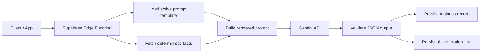

# Numverse Prompt Architecture

## Mục đích

Tài liệu này chốt kiến trúc `prompt/context/output` cho 4 nhóm chức năng AI của `Numverse`, dựa trên:
- [NUMVERSE_PRODUCT_SUMMARY.md](/Users/uranidev/Documents/Numverse/NUMVERSE_PRODUCT_SUMMARY.md)
- [NUMVERSE_MOBILE_WIREFRAMES_LOFI.md](/Users/uranidev/Documents/Numverse/NUMVERSE_MOBILE_WIREFRAMES_LOFI.md)
- [NUMVERSE_USER_FLOW_UX_LOGIC.md](/Users/uranidev/Documents/Numverse/NUMVERSE_USER_FLOW_UX_LOGIC.md)
- [NUMVERSE_DATA_MODEL.md](/Users/uranidev/Documents/Numverse/NUMVERSE_DATA_MODEL.md)

Phạm vi:
- `life-based narrative`
- `time-based narrative`
- `compatibility narrative`
- `NumAI chat reply`

## 1. Nguyên tắc nền

### 1.1. Tách rõ `facts` và `narrative`

- `Code / deterministic` tính ra bộ số và cấu trúc numerology.
- `Gemini` chỉ diễn giải ý nghĩa từ các facts đã có.
- Model không được tự tính lại numerology.

### 1.2. Prompt là dữ liệu có version

- Prompt được lưu trong `public.prompt_templates`.
- Runtime chỉ dùng bản `active` theo `prompt_key + locale`.
- Mọi lần generate phải log `prompt_template_id`, `prompt_key`, `prompt_version`.

### 1.3. Context phải nhỏ và đúng mục đích

- Chỉ gửi đúng dữ liệu cần cho use case hiện tại.
- Không gửi narrative cũ dài dòng nếu facts đã đủ.
- Với `NumAI` MVP, dùng payload cố định đã chốt.

### 1.4. Output phải là `structured JSON`

- Không dùng output text tự do làm source of truth.
- Mỗi prompt phải có `output_schema_json`.
- Edge Function phải validate output trước khi persist.

### 1.5. `Generate once, read many`

- `Life-based`: generate theo snapshot.
- `Time-based preview`: generate theo `profile + local_date`.
- `Time-based month detail`: generate theo `profile + year_month`.
- `Time-based year detail`: generate theo `profile + year`.
- `Time-based active phase detail`: generate theo `profile + phase_key`.
- `Compatibility`: generate theo `profile pair + engine version`.
- `NumAI`: generate theo từng request chat.

## 2. Runtime Architecture



## 3. Prompt Template Registry

Nguồn prompt chính nằm trong:
- `public.prompt_templates`

Các `prompt_key` MVP:
- `life_snapshot_narrative`
- `daily_reading_narrative`
- `monthly_reading_narrative`
- `yearly_reading_narrative`
- `active_phase_narrative`
- `compatibility_narrative`
- `numai_chat_reply`

Mỗi prompt template nên có:
- `prompt_key`
- `version`
- `locale`
- `status`
- `provider`
- `model_name`
- `temperature`
- `max_output_tokens`
- `system_prompt`
- `task_prompt_template`
- `context_schema_json`
- `output_schema_json`

## 4. Base Prompt Contract

Phần này áp dụng cho cả 4 nhóm.

### 4.1. Vai trò model

`Numverse AI narrative engine`

### 4.2. Rule chung

- Chỉ diễn giải từ facts được cung cấp.
- Không tự tính lại chỉ số numerology.
- Không khẳng định tuyệt đối.
- Dùng tiếng Việt tự nhiên, rõ, dễ hiểu.
- Tránh văn phong thần bí quá mức.
- Ưu tiên câu ngắn, actionable.
- Nếu context thiếu, nói theo hướng `dựa trên bộ số hiện có`.

### 4.3. Cấu trúc prompt render ở runtime

```text
[System Prompt]
{{system_prompt}}

[Task Prompt]
{{task_prompt_template}}

[Context JSON]
{{context_json}}

[Output Schema JSON]
{{output_schema_json}}
```

### 4.4. Output validation rules

- JSON phải parse được.
- Đúng shape đã khai báo.
- Các field bắt buộc phải tồn tại.
- Nếu fail validation:
  - log `ai_generation_runs.status = failed`
  - không overwrite dữ liệu hiện tại
  - có thể retry bằng prompt cùng version hoặc fallback strategy

## 5. Nhóm `Life-based`

### 5.1. Mục tiêu

Sinh narrative cho tab `Luận giải` từ snapshot numerology deterministic.

### 5.2. `prompt_key`

`life_snapshot_narrative`

### 5.3. Source context

Lấy từ:
- `public.numerology_profiles`
- `public.numerology_snapshots`

### 5.4. Context schema

```json
{
  "profile": {
    "profile_id": "uuid",
    "display_name": "Minh",
    "locale": "vi-VN"
  },
  "snapshot": {
    "snapshot_id": "uuid",
    "core_numbers": {
      "life_path": 7,
      "expression": 3,
      "soul_urge": 2,
      "personality": 1
    },
    "birth_matrix": {},
    "matrix_aspects": {},
    "life_cycles": {}
  }
}
```

### 5.5. Prompt objective

- Giải thích rõ từng nhóm `Chỉ số cốt lõi`, `Biểu đồ và ma trận`, `Lộ trình cuộc đời`, `Chân dung cá nhân`.
- Biến dữ liệu số thành ngôn ngữ đời sống.
- Tạo một `compact_summary` để tái sử dụng ở các nhóm khác.

### 5.6. Output schema

```json
{
  "core_numbers": {
    "life_path": {
      "summary": "string",
      "deep_meaning": "string",
      "strengths": ["string"],
      "balance_points": ["string"]
    },
    "expression": {},
    "soul_urge": {},
    "personality": {}
  },
  "birth_matrix": {
    "overview": "string",
    "strong_numbers": ["string"],
    "weak_numbers": ["string"],
    "missing_numbers": ["string"]
  },
  "matrix_aspects": {
    "physical_axis": "string",
    "emotional_axis": "string",
    "intellectual_axis": "string",
    "arrows": [
      {
        "key": "string",
        "meaning": "string"
      }
    ]
  },
  "life_cycles": {
    "overview": "string",
    "peaks": [
      {
        "index": 1,
        "meaning": "string"
      }
    ],
    "challenges": [
      {
        "index": 1,
        "meaning": "string"
      }
    ]
  },
  "persona": {
    "overview": "string",
    "communication": "string",
    "love": "string",
    "career": "string"
  },
  "compact_summary": {
    "identity_summary": "string",
    "top_strengths": ["string"],
    "top_balance_points": ["string"]
  }
}
```

### 5.7. Persistence target

- `public.numerology_snapshot_narratives.sections_json`

### 5.8. Cost strategy

- Generate `1 lần / snapshot`.
- Chỉ regenerate khi:
  - snapshot deterministic đổi
  - prompt version đổi
  - model strategy đổi

## 6. Nhóm `Time-based`

### 6.1. Mục tiêu

Sinh nội dung cho tab `Hôm nay` theo cấu trúc:
- `daily preview`
- `month detail`
- `year detail`
- `active phase detail`

### 6.2. `prompt_key`

`daily_reading_narrative`

### 6.3. Source context

Lấy từ:
- `public.numerology_profiles`
- `public.numerology_snapshots`
- deterministic daily calculation
- `numerology_snapshot_narratives.sections_json.compact_summary` nếu đã có

### 6.4. Context schema

```json
{
  "profile": {
    "profile_id": "uuid",
    "display_name": "Minh",
    "locale": "vi-VN",
    "timezone": "Asia/Ho_Chi_Minh"
  },
  "date_context": {
    "local_date": "2026-03-04",
    "personal_year": 8,
    "personal_month": 5,
    "personal_day": 3,
    "active_peak_number": 2,
    "active_challenge_number": 1
  },
  "life_summary_compact": {
    "identity_summary": "string",
    "top_strengths": ["string"],
    "top_balance_points": ["string"]
  }
}
```

### 6.5. Prompt objective

- Tạo output ngắn, dễ đọc trong `10 giây đầu`.
- Ưu tiên `Hero card` và `Action card`.
- Chỉ tạo preview ngắn để render `Bối cảnh hiện tại`.

### 6.6. Output schema

```json
{
  "hero_text": "string",
  "energy_score": 7,
  "daily_rhythm": "string",
  "daily_insight_short": "string",
  "daily_insight_full": "string",
  "action_do": ["string", "string"],
  "action_avoid": ["string", "string"],
  "month_context": {
    "title": "string",
    "summary": "string"
  },
  "year_context": {
    "title": "string",
    "summary": "string"
  },
  "active_phase": {
    "title": "string",
    "summary": "string"
  }
}
```

### 6.7. Persistence target

- `public.daily_readings`

Mapping gợi ý:
- `hero_text` -> có thể dùng cho top card
- `daily_insight_short` -> free layer
- `daily_insight_full` -> pro layer
- `action_do` -> `action_do_json`
- `action_avoid` -> `action_avoid_json`
- `month_context` -> `month_context_json`
- `year_context` -> `year_context_json`
- `active_phase` -> `active_phase_json`

### 6.8. Cost strategy

- Generate `1 lần / profile / local_date`.
- Cache trong `daily_readings`.
- Không generate lại mỗi lần app mở.
- Không dùng prompt này để generate full detail của `tháng`, `năm`, `giai đoạn active`.

### 6.9. `prompt_key`

`monthly_reading_narrative`

### 6.10. Source context

Lấy từ:
- `public.numerology_profiles`
- `public.numerology_snapshots`
- deterministic monthly calculation
- `numerology_snapshot_narratives.sections_json.compact_summary` nếu đã có

### 6.11. Context schema

```json
{
  "profile": {
    "profile_id": "uuid",
    "display_name": "Minh",
    "locale": "vi-VN",
    "timezone": "Asia/Ho_Chi_Minh"
  },
  "month_context": {
    "local_year": 2026,
    "local_month": 3,
    "personal_year": 8,
    "personal_month": 5
  },
  "life_summary_compact": {
    "identity_summary": "string",
    "top_strengths": ["string"],
    "top_balance_points": ["string"]
  }
}
```

### 6.12. Prompt objective

- Tạo content dài hơn preview tháng ở home.
- Giải thích rõ `trọng tâm tháng`, `điều nên ưu tiên`, `điều cần chú ý`.
- Giữ văn phong định hướng và ứng dụng được.

### 6.13. Output schema

```json
{
  "headline": "string",
  "summary_text": "string",
  "focus_text": "string",
  "opportunities": ["string"],
  "cautions": ["string"],
  "guidance": ["string"]
}
```

### 6.14. Persistence target

- `public.monthly_readings`

### 6.15. Cost strategy

- Generate `1 lần / profile / year_month`.
- Chỉ generate khi user mở màn `Chi tiết tháng này`.
- Cache theo tháng hiện tại, không generate lại mỗi ngày.

### 6.16. `prompt_key`

`yearly_reading_narrative`

### 6.17. Source context

Lấy từ:
- `public.numerology_profiles`
- `public.numerology_snapshots`
- deterministic yearly calculation
- `numerology_snapshot_narratives.sections_json.compact_summary` nếu đã có

### 6.18. Context schema

```json
{
  "profile": {
    "profile_id": "uuid",
    "display_name": "Minh",
    "locale": "vi-VN",
    "timezone": "Asia/Ho_Chi_Minh"
  },
  "year_context": {
    "local_year": 2026,
    "personal_year": 8
  },
  "life_summary_compact": {
    "identity_summary": "string",
    "top_strengths": ["string"],
    "top_balance_points": ["string"]
  }
}
```

### 6.19. Prompt objective

- Tạo nội dung detail cho `Chi tiết năm nay`.
- Nêu rõ `chủ đề năm`, `ưu tiên`, `cảnh báo`, `gợi ý phát triển`.
- Không lặp lại chỉ preview ngắn ở màn home.

### 6.20. Output schema

```json
{
  "headline": "string",
  "summary_text": "string",
  "theme_text": "string",
  "priorities": ["string"],
  "cautions": ["string"],
  "guidance": ["string"]
}
```

### 6.21. Persistence target

- `public.yearly_readings`

### 6.22. Cost strategy

- Generate `1 lần / profile / year`.
- Chỉ generate khi user mở màn `Chi tiết năm nay`.

### 6.23. `prompt_key`

`active_phase_narrative`

### 6.24. Source context

Lấy từ:
- `public.numerology_profiles`
- `public.numerology_snapshots`
- deterministic active phase derivation
- `numerology_snapshot_narratives.sections_json.compact_summary` nếu đã có

### 6.25. Context schema

```json
{
  "profile": {
    "profile_id": "uuid",
    "display_name": "Minh",
    "locale": "vi-VN",
    "timezone": "Asia/Ho_Chi_Minh"
  },
  "phase_context": {
    "phase_key": "peak2-challenge1-2026-01-01-2026-12-31",
    "phase_start_date": "2026-01-01",
    "phase_end_date": "2026-12-31",
    "active_peak_number": 2,
    "active_challenge_number": 1
  },
  "life_summary_compact": {
    "identity_summary": "string",
    "top_strengths": ["string"],
    "top_balance_points": ["string"]
  }
}
```

### 6.26. Prompt objective

- Giải thích mối liên hệ giữa `đỉnh cao active` và `thử thách active`.
- Nối lớp `time-based` với `life-based`.
- Tạo guidance rõ ràng cho giai đoạn hiện tại.

### 6.27. Output schema

```json
{
  "headline": "string",
  "summary_text": "string",
  "peak_text": "string",
  "challenge_text": "string",
  "guidance": ["string"]
}
```

### 6.28. Persistence target

- `public.active_phase_readings`

### 6.29. Cost strategy

- Generate `1 lần / profile / phase_key`.
- Chỉ generate khi user mở màn `Chi tiết giai đoạn active`.

## 7. Nhóm `Compatibility`

### 7.1. Mục tiêu

Sinh narrative tương hợp giữa 2 hồ sơ dựa trên facts của cả hai bên.

### 7.2. `prompt_key`

`compatibility_narrative`

### 7.3. Source context

Lấy từ:
- `public.numerology_profiles`
- `public.numerology_snapshots`
- `compatibility_structure_json` hoặc score tính deterministic
- `compact_summary` của cả hai hồ sơ nếu có

### 7.4. Context schema

```json
{
  "primary_profile": {
    "profile_id": "uuid",
    "display_name": "Minh"
  },
  "target_profile": {
    "profile_id": "uuid",
    "display_name": "Lan"
  },
  "primary_facts": {
    "core_numbers": {},
    "matrix_aspects": {},
    "life_cycles": {}
  },
  "target_facts": {
    "core_numbers": {},
    "matrix_aspects": {},
    "life_cycles": {}
  },
  "compatibility_structure": {
    "score": 74,
    "signals": ["string"]
  },
  "primary_life_summary_compact": {
    "identity_summary": "string"
  },
  "target_life_summary_compact": {
    "identity_summary": "string"
  }
}
```

### 7.5. Prompt objective

- Không chỉ nói `hợp / không hợp`.
- Phải trả ra:
  - điểm hòa hợp
  - điểm dễ xung đột
  - gợi ý ứng xử

### 7.6. Output schema

```json
{
  "summary": "string",
  "strengths": ["string"],
  "tensions": ["string"],
  "guidance": ["string"],
  "compact_summary": "string"
}
```

### 7.7. Persistence target

- `public.compatibility_reports`

Mapping gợi ý:
- `summary` -> `summary`
- `strengths` -> `strengths_json`
- `tensions` -> `tensions_json`
- `guidance` -> `guidance_json`

### 7.8. Cost strategy

- Generate `1 lần / cặp hồ sơ / engine version`.
- Không generate lại nếu report cache còn hợp lệ.

## 8. Nhóm `NumAI`

### 8.1. Mục tiêu

Trả lời câu hỏi động của user dựa trên:
- mạch hội thoại gần nhất
- hồ sơ đang active
- facts deterministic đã tính

### 8.2. `prompt_key`

`numai_chat_reply`

### 8.3. Source context

Lấy từ:
- `public.ai_threads`
- `public.ai_messages`
- `public.numerology_profiles`
- `public.numerology_snapshots`

### 8.4. Context schema MVP

Đây là payload cố định hiện tại.

```json
{
  "thread_summary": {
    "summary": "string",
    "updated_at": "2026-03-04T09:00:00Z"
  },
  "recent_messages": [
    {
      "role": "user",
      "text": "string"
    },
    {
      "role": "assistant",
      "text": "string"
    }
  ],
  "active_profile": {
    "profile_id": "uuid",
    "display_name": "Minh",
    "profile_kind": "self",
    "relation_kind": "self",
    "timezone": "Asia/Ho_Chi_Minh"
  },
  "snapshot_facts": {
    "core_numbers": {},
    "birth_matrix": {},
    "matrix_aspects": {},
    "life_cycles": {}
  },
  "user_question": "string",
  "context_type": "general"
}
```

### 8.5. MVP constraints

- Chưa inject `daily_facts`.
- Chưa inject `compatibility_facts`.
- Chưa dùng `intent detection`.
- `context_type` hiện tại chỉ đóng vai trò `hint`.

### 8.6. Prompt objective

- Trả lời ngắn, rõ, đúng trọng tâm câu hỏi.
- Bám chặt vào `snapshot_facts` và mạch hội thoại gần nhất.
- Không chuyển thành therapist hoặc fortune teller tổng quát.
- Nếu user hỏi về `today` hoặc `compatibility`, model vẫn trả lời trên facts hiện có, không bịa thêm context chuyên biệt.

### 8.7. Output schema

```json
{
  "answer": "string",
  "referenced_sections": ["string"],
  "follow_up_suggestions": ["string"]
}
```

### 8.8. Persistence target

- `public.ai_messages.message_text`
- `public.ai_messages.metadata_json`
- `public.ai_generation_runs`

Mapping gợi ý:
- `answer` -> `message_text`
- `referenced_sections` -> `metadata_json.referenced_sections`
- `follow_up_suggestions` -> `metadata_json.follow_up_suggestions`

### 8.9. Cost strategy

- Chỉ gửi tối đa `20` tin nhắn gần nhất.
- `thread_summary.summary` nên ngắn, ví dụ `<= 800` ký tự.
- Không gửi full narrative dài từ `Luận giải`.
- Dùng `snapshot_facts` làm context nền.

## 9. Prompt Design Rules Theo Từng Nhóm

### 9.1. `Life-based`

- Dài hơn các nhóm khác.
- Ưu tiên chiều sâu và cấu trúc rõ section.
- Không cần quá ngắn vì generate ít lần.

### 9.2. `Time-based`

- `daily_reading_narrative` phải tối ưu cho đọc nhanh.
- `hero_text` và `daily_insight_short` phải ngắn.
- `action_do` và `action_avoid` nên chỉ có `2` item chính.
- `monthly_reading_narrative`, `yearly_reading_narrative`, `active_phase_narrative` là các prompt detail riêng, có thể dài hơn preview nhưng vẫn phải đúng trọng tâm của từng màn.

### 9.3. `Compatibility`

- Tránh wording phán xét.
- Không nên gắn nhãn quan hệ là `tốt/xấu` tuyệt đối.
- Guidance phải thực tế và ứng dụng được.

### 9.4. `NumAI`

- Ngắn, conversational, đúng câu hỏi.
- Không dump cả một bài luận nếu user chỉ hỏi một ý nhỏ.
- Luôn có thể gợi ý `2-3` câu hỏi tiếp theo.

## 10. Prompt Versioning Rules

- Mỗi lần đổi prompt làm thay đổi output logic phải tăng `version`.
- Chỉ một bản `active` cho mỗi `prompt_key + locale`.
- Bản cũ chuyển sang `archived`, không bị xóa.
- `ai_generation_runs` phải giữ được snapshot prompt đã dùng để audit.

## 11. Output Quality Checklist

Mỗi prompt trước khi đưa `active` nên check:
- Có đúng tiếng Việt tự nhiên không.
- Có bám vào facts hay không.
- Có tự tính lại numerology không.
- Có bị lan man hơn nhu cầu của màn hình không.
- Có parse được theo schema không.
- Có đủ ngắn cho use case tương ứng không.

## 12. Quyết định chốt cho MVP

1. Dùng `7 prompt_key` cho các artifact AI của MVP:
   - `life_snapshot_narrative`
   - `daily_reading_narrative`
   - `monthly_reading_narrative`
   - `yearly_reading_narrative`
   - `active_phase_narrative`
   - `compatibility_narrative`
   - `numai_chat_reply`
2. Prompt được quản lý trong `public.prompt_templates`.
3. Runtime lấy `active prompt version`.
4. Mọi output AI đều phải có schema JSON.
5. `NumAI` MVP chỉ dùng payload cố định:
   - `thread_summary`
   - `recent_messages`
   - `active_profile`
   - `snapshot_facts`
   - `user_question`
   - `context_type`
6. `daily_facts` và `compatibility_facts` để phase sau.

## 13. Next Step Gợi ý

1. Viết `seed data` cho `public.prompt_templates`.
2. Viết `Supabase Edge Function spec` cho 7 `prompt_key`.
3. Chốt `schema validator` cho output JSON của Gemini.
